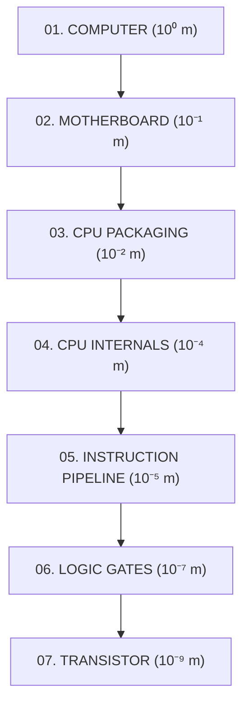

# ⚡ INSIDE THE MACHINE
### *A Scroll-Driven 3D Journey from a Computer to an Atomic Transistor*

<div align="center">

[](https://vitejs.dev/)
[](https://www.typescriptlang.org/)
[](https://aframe.io/)
[](https://threejs.org/)
[](https://developer.mozilla.org/en-US/docs/Web/API/Web_Audio_API)
[](LICENSE)

**[🚀 Live Demo](http://localhost:5173/)** • **[📖 Documentation](#-the-7-computational-layers)** • **[🕹️ Interactive Sandboxes](#-interactive-sandboxes--simulations)** • **[🛠️ Architecture](#-project-architecture)**

</div>

---

## 💡 The Core Concept

**Inside the Machine** is a scrollytelling WebGL 3D educational experience. As the user scrolls down the page, the camera plunges from the macroscopic view of an open computer chassis down into silicon microarchitecture, logic gates, and ultimately a single nanoscale transistor switch.

The entire experience communicates one fundamental principle:
> **Every piece of modern software — from simple calculators to planetary-scale AI models — emerges entirely from billions of tiny electronic switches flipping between ON ($1$) and OFF ($0$).**

---

## 🌌 The 7 Computational Layers



| Layer | Scale | Stage Name | Visual & Architectural Focus | Interactive Experience |
|:---:|:---:|:---|:---|:---|
| **01** | $10^0\text{ m}$ ($1\text{m}$) | **COMPUTER** | Aluminum chassis, high-airflow RGB intake fans, base pedestal, ambient data dust | Stage intro, continuous scroll initiation |
| **02** | $10^{-1}\text{ m}$ ($10\text{cm}$) | **MOTHERBOARD** | ATX PCB layout, CPU socket, DDR5 RAM sticks, PCIe slots, NVMe SSD, VRM heatsinks | Click-to-inspect hardware telemetry |
| **03** | $10^{-2}\text{ m}$ ($1\text{cm}$) | **CPU PACKAGING** | LGA gold pin array, nickel copper heat spreader (IHS), raw silicon crystal die | Silicon portal zoom tunnel |
| **04** | $10^{-4}\text{ m}$ ($100\mu\text{m}$) | **CPU INTERNALS** | Control Unit (CU), Arithmetic Logic Unit (ALU), Register banks, L1/L2 Cache | Microarchitecture unit inspector & live data bus highway |
| **05** | $10^{-5}\text{ m}$ ($10\mu\text{m}$) | **INSTRUCTION FLOW** | 4-stage pipeline execution: `FETCH` $\rightarrow$ `DECODE` $\rightarrow$ `ALU (5+3)` $\rightarrow$ `WRITEBACK (8)` | Real-time instruction cycle walkthrough |
| **06** | $10^{-7}\text{ m}$ ($100\text{nm}$) | **LOGIC GATES** | 3D Boolean gates (AND, OR, NOT) with input/output pins and inversion bubbles | Live Boolean logic experimentation sandbox |
| **07** | $10^{-9}\text{ m}$ ($1\text{nm}$) | **TRANSISTOR** | Atomic MOSFET switch, P-type substrate, Source/Drain wells, Gate dielectric & electrode | Gate voltage toggle ($0 \leftrightarrow 1$) with live electron particle flow |

---

## ✨ Features & Highlights

### 🎥 1. Continuous Scroll-Driven 3D Choreography
- **Single Continuous World**: No disjointed page jumps or artificial level loads. The 3D scene is persistent and smoothly lerped on every frame.
- **Bi-Directional Camera Physics**: Scrolling down glides deeper into the machine; scrolling up flies back out to macroscopic scale.
- **Non-blocking Scroll Track**: Native mouse wheel, precision trackpad, keyboard navigation, and touch swipe gestures are supported seamlessly without scroll-jacking traps.

### 🔬 2. Real 3D GLB Meshes + Procedural Aesthetics
- Custom-generated high-detail `.glb` models for Chassis, Motherboard, CPU Die, Microarchitecture Blocks, Logic Gates, and Transistors.
- Emissive glow pulses, moving particle streams, and depth fog ($#05070a$) create a scientific research laboratory atmosphere.

### 🕹️ 3. Interactive Sandboxes & Simulations
- **Hardware Component Inspector**: Click on CPU, RAM, GPU, Storage, VRM, Control Unit, ALU, Registers, Cache, or Transistor to view real-time architectural specifications.
- **Boolean Logic Lab**: Toggle inputs on AND, OR, and NOT gates in real time to observe live truth-table outputs and 3D terminal pin luminescence.
- **MOSFET Switch Controller**: Toggle gate voltage between HIGH ($1$) and LOW ($0$) to turn electron channel conduction on and off dynamically.

### 🔊 4. Zero-Dependency Web Audio Synthesizer
- Built using the native **Web Audio API** with zero external audio assets.
- Procedurally synthesized drone frequencies, depth-pitch modulation, mechanical relay clicks, UI chimes, and warp whooshes.

### 🛰️ 5. Real-Time Telemetry HUD
- Real-time 3D coordinate tracking ($X, Y, Z$ camera depth).
- Dynamic observation scale badges ($10^0\text{m} \rightarrow 10^{-9}\text{m}$).
- Stage jump ladder on the left sidebar with progress bar synchronization.

---

## 🎮 Navigation & Keyboard Controls

| Input | Action |
|:---|:---|
| **Scroll Wheel / Trackpad** | Fly forward (deeper) or backward through the 3D layers |
| **$\downarrow$ / $\uparrow$ Arrows** | Step forward / backward along the journey |
| **PageDown / PageUp** | Rapid stage travel |
| **Home / End** | Jump directly to Start (Computer) or End (Transistor) |
| **Sidebar Ladder** | Click any stage badge (01–07) to jump straight to that layer |
| **Left Click (3D Object)** | Open hardware component telemetry inspector |
| **Sound Button (Top Right)**| Toggle procedural Web Audio ambient soundtrack & sound effects |

---

## 🛠️ Technology Stack & Architecture

- **3D Engine**: [A-Frame 1.6.0](https://aframe.io/) (Three.js WebGL backend)
- **Language**: TypeScript (Strict Mode)
- **Bundler & Dev Server**: [Vite](https://vitejs.dev/)
- **UI & HUD**: Vanilla CSS with Glassmorphism, CSS Custom Properties, and responsive flexbox/grid
- **Audio**: Web Audio API (Sub-bass drone oscillator + bi-quad filter + custom gain envelopes)
- **Model Generation**: Three.js GLTFExporter with Node.js buffer streaming

### 📁 Directory Structure

```
inside-the-machine/
├── public/
│   ├── favicon.svg               # Cyber-hardware SVG tab icon
│   └── models/                   # 3D GLB model assets
│       ├── computer.glb          # Computer chassis
│       ├── motherboard.glb       # Motherboard & slots
│       ├── cpu.glb               # Silicon die & packaging
│       ├── cpu-internals.glb     # Microarchitecture blocks
│       ├── logic-gates.glb       # AND / OR / NOT gates
│       └── transistor.glb        # Nanoscale MOSFET switch
├── src/
│   ├── audio/
│   │   └── sound-synth.ts        # Procedural Web Audio synthesizer
│   ├── core/
│   │   ├── hud-controller.ts     # 2D HUD & telemetry synchronization
│   │   ├── interaction-manager.ts# Click targets, logic gates & transistor state
│   │   └── scroll-camera-controller.ts # Smooth scroll interpolation engine
│   ├── data/
│   │   ├── components.ts         # Telemetry database & hardware specs
│   │   └── stages.ts             # Camera waypoints & scale milestones
│   ├── scenes/                   # 3D Scene builders & GLB mounts
│   │   ├── computer-chassis.ts
│   │   ├── cpu-internals.ts
│   │   ├── cpu-packaging.ts
│   │   ├── instruction-pipeline.ts
│   │   ├── logic-gates-scene.ts
│   │   ├── motherboard-scene.ts
│   │   ├── scale-universe.ts
│   │   ├── transistor-scene.ts
│   │   └── world-builder.ts
│   ├── styles/
│   │   └── main.css              # Cyber-scientific HUD styles
│   └── main.ts                   # Application bootstrap
├── scripts/
│   └── generate-models.js        # Node.js 3D model generator script
├── index.html                    # Root HTML & A-Frame scene
├── package.json
└── tsconfig.json
```

---

## 🚀 Quick Start Guide

### Prerequisites
- [Node.js](https://nodejs.org/) (version 18.0 or higher recommended)
- [npm](https://www.npmjs.com/) or [pnpm](https://pnpm.io/)

### Installation & Execution

```bash
# 1. Clone the repository
git clone https://github.com/p3xz/inside-the-computer.git
cd inside-the-computer/inside-the-machine

# 2. Install dependencies
npm install

# 3. (Optional) Re-generate GLB 3D models
node scripts/generate-models.js

# 4. Start local development server
npm run dev
```

Open `http://localhost:5173` in your browser to experience the journey.

### Production Build

```bash
# Compile TypeScript and bundle optimized production assets
npm run build

# Preview production build locally
npm run preview
```

---

## 🎨 Design Philosophy & Color Palette

The visual design is grounded in a **futuristic scientific instrumentation** aesthetic:

| Color | Hex | Role |
|:---|:---:|:---|
| **Deep Space Black** | `#05070A` | Primary backdrop & fog color |
| **Substrate Slate** | `#0B1117` | Structural frame & die foundation |
| **Electric Cyan** | `#00E5FF` | Active components, electron signals, logic HIGH ($1$) |
| **Deep Violet** | `#7C3AED` | Microscopic silicon environment & secondary emphasis |
| **High-Purity White** | `#F5F7FA` | Primary typography & scientific readouts |
| **Muted Telemetry** | `#8B98A7` | Secondary technical labels & grid coordinates |

---

## 📜 License

This project is open source and available under the [MIT License](LICENSE).
